# Альбом графиков

Все рисунки решения кейса по прогнозированию добычи нефти и газа месторождения Volve. Сначала сами графики с подписями, ниже — легенда: название, обоснование и описание каждого.

Нумерация сквозная: **G1–G36**. Файлы лежат в [`figures/`](figures/).

---

## Графики

### G1. Месячный профиль нефти, контрольное окно 2

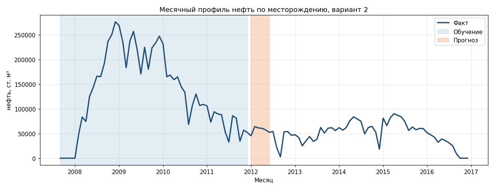

*Подпись.* Месячная добыча нефти по месторождению Volve. Голубая заливка — обучение (до 2011-12), оранжевая — прогноз (2012-01 — 2012-06).

### G2. Месячный профиль газа, контрольное окно 4

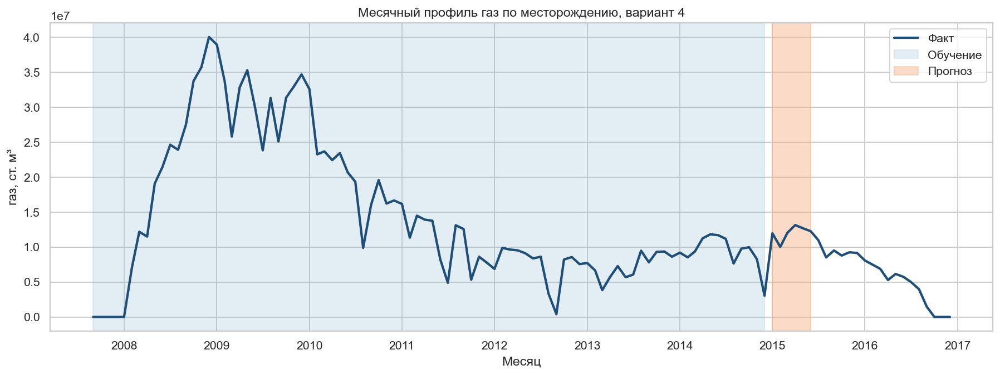

*Подпись.* Месячная добыча газа по месторождению. Голубая заливка — обучение (до 2014-12), оранжевая — прогноз (2015-01 — 2015-06).

### G3. Кривые падения нефти по стволам

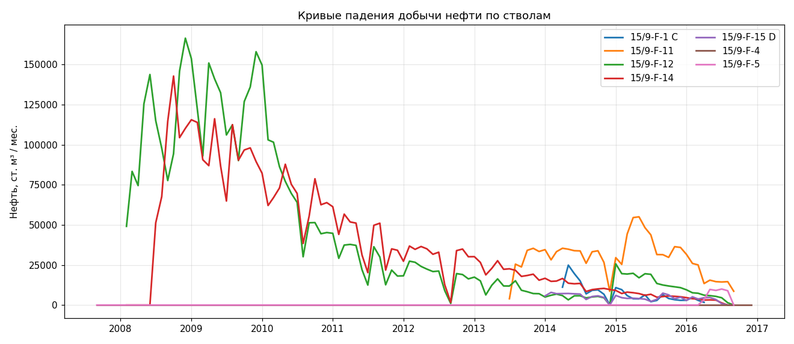

*Подпись.* Месячная добыча нефти отдельно по каждому стволу Volve.

### G4. Декомпозиция ряда нефти

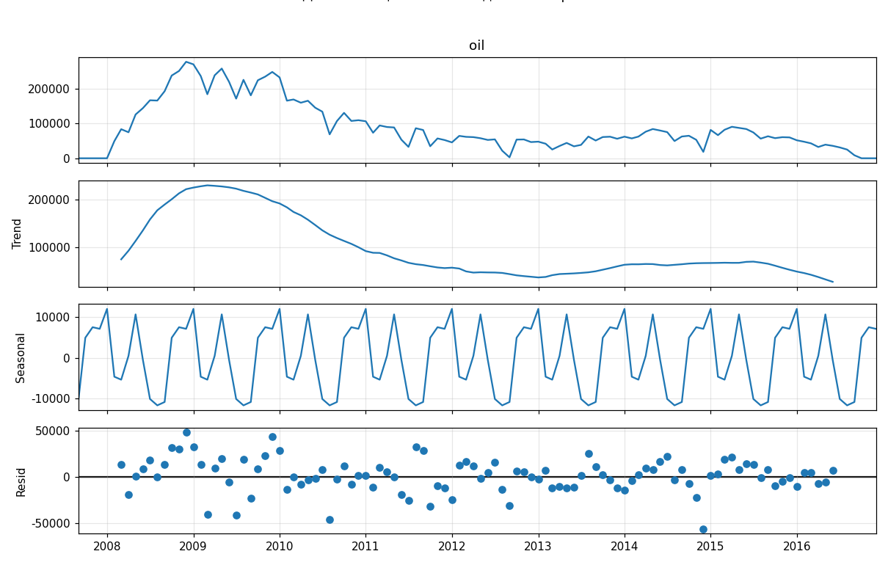

*Подпись.* Аддитивное разложение месячной добычи нефти: наблюдение, тренд, сезонность с периодом 12 месяцев, остаток.

### G5. Нефть, окно 2: факт, Арпс и модель

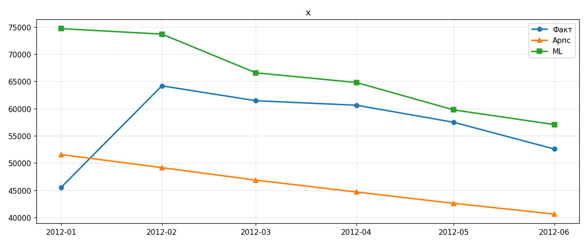

*Подпись.* Сравнение факта, кривой Арпса и выбранной модели на прогнозе 2012 H1.

### G6. Скважина 15/9-F-12, 2015 H1

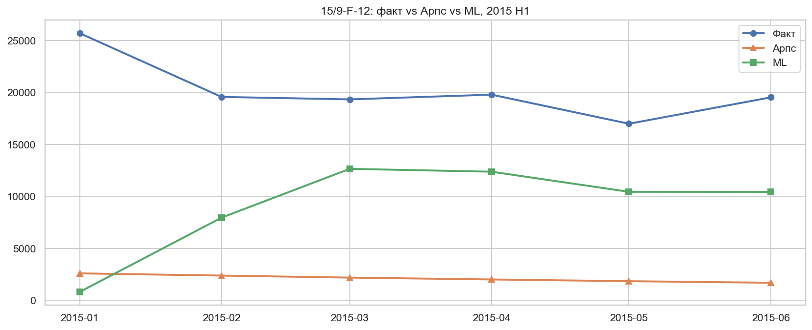

*Подпись.* Тот же протокол, что окно 4, но только для ствола F-12.

---

### Окно 1 · нефть · 2010 H1

### G7. Нефть, окно 1: факт и прогноз

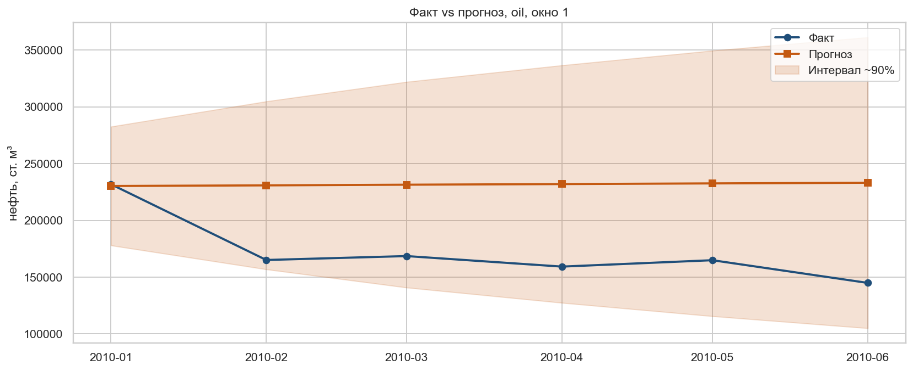

*Подпись.* Факт, прогноз и интервал неопределённости (~90%) по нефти, январь–июнь 2010.

### G8. Нефть, окно 1: абсолютная ошибка

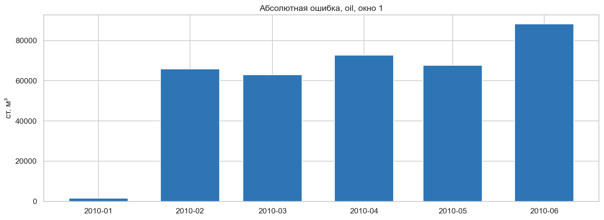

*Подпись.* |факт − прогноз|, ст. м³ / мес.

### G9. Нефть, окно 1: относительная ошибка

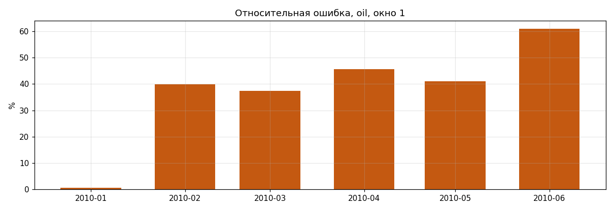

*Подпись.* |факт − прогноз| / |факт| × 100%.

### Окно 1 · газ · 2010 H1

### G10. Газ, окно 1: факт и прогноз

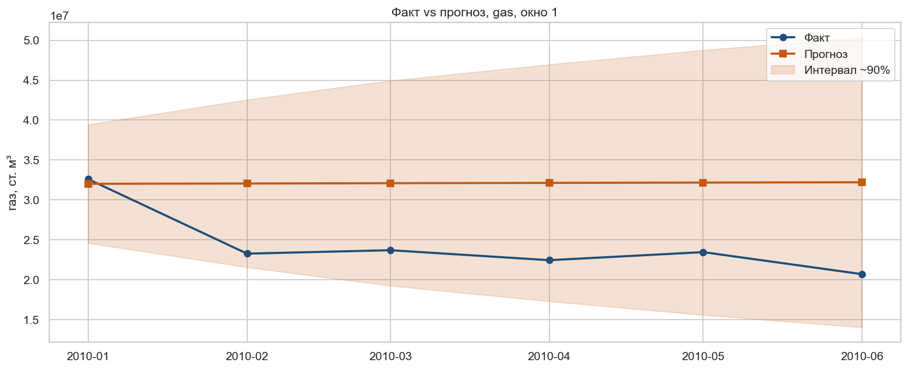

*Подпись.* Факт, прогноз и интервал (~90%) по газу, январь–июнь 2010.

### G11. Газ, окно 1: абсолютная ошибка

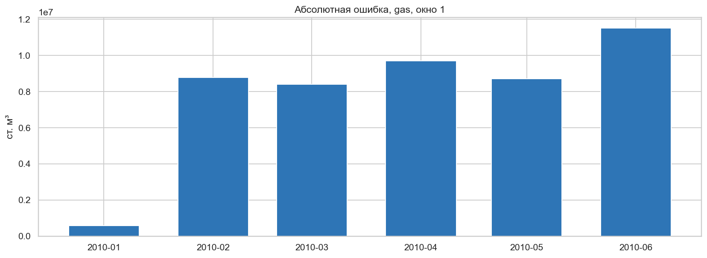

*Подпись.* |факт − прогноз|, ст. м³ / мес.

### G12. Газ, окно 1: относительная ошибка

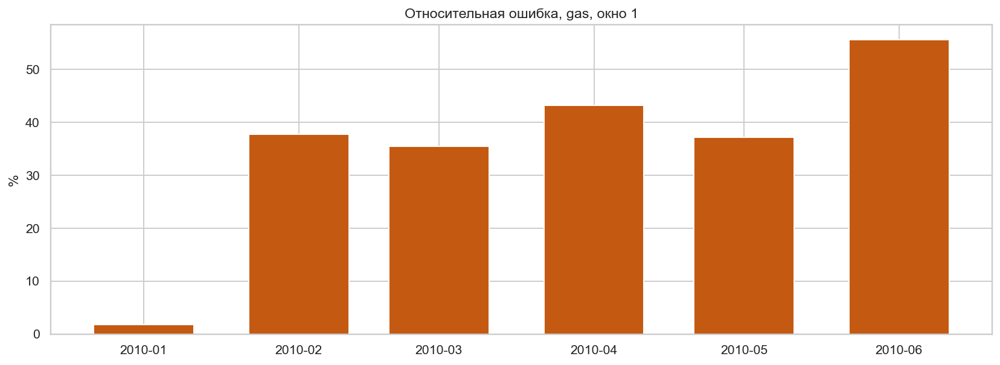

*Подпись.* |факт − прогноз| / |факт| × 100%.

---

### Окно 2 · нефть · 2012 H1

### G13. Нефть, окно 2: факт и прогноз

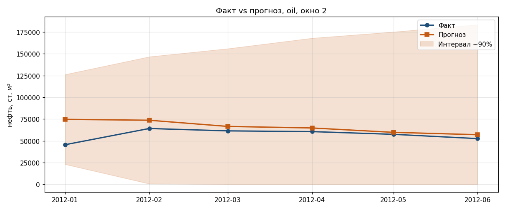

*Подпись.* Факт, прогноз и интервал (~90%) по нефти, январь–июнь 2012.

### G14. Нефть, окно 2: абсолютная ошибка

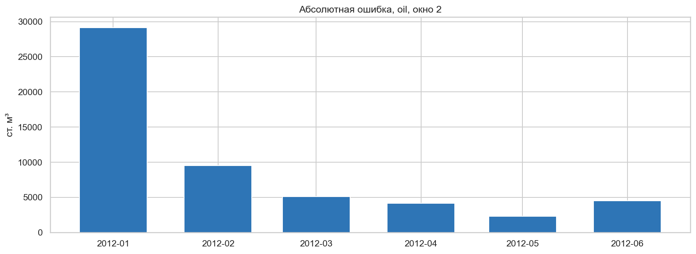

*Подпись.* |факт − прогноз|, ст. м³ / мес.

### G15. Нефть, окно 2: относительная ошибка

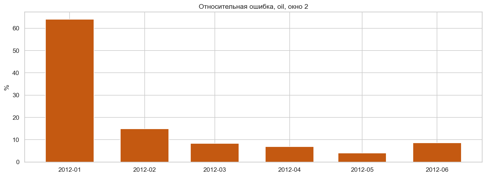

*Подпись.* |факт − прогноз| / |факт| × 100%.

### Окно 2 · газ · 2012 H1

### G16. Газ, окно 2: факт и прогноз

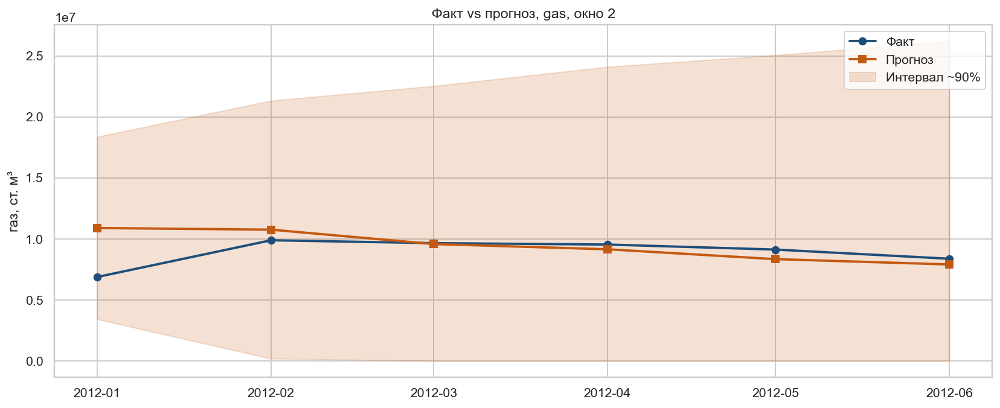

*Подпись.* Факт, прогноз и интервал (~90%) по газу, январь–июнь 2012.

### G17. Газ, окно 2: абсолютная ошибка

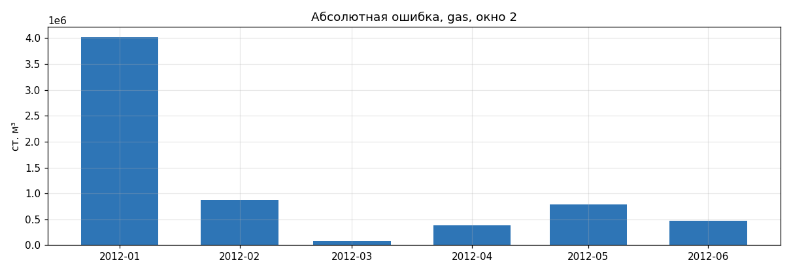

*Подпись.* |факт − прогноз|, ст. м³ / мес.

### G18. Газ, окно 2: относительная ошибка

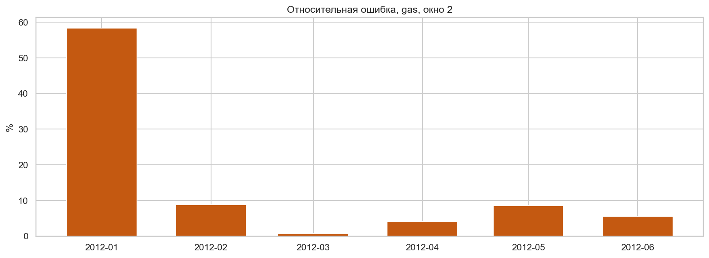

*Подпись.* |факт − прогноз| / |факт| × 100%.

---

### Окно 3 · нефть · 2014 H1

### G19. Нефть, окно 3: факт и прогноз

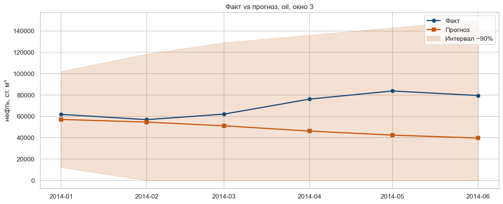

*Подпись.* Факт, прогноз и интервал (~90%) по нефти, январь–июнь 2014.

### G20. Нефть, окно 3: абсолютная ошибка

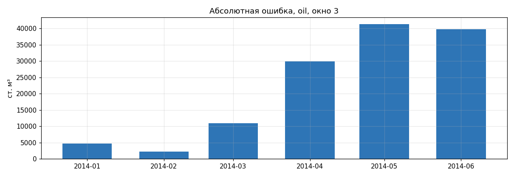

*Подпись.* |факт − прогноз|, ст. м³ / мес.

### G21. Нефть, окно 3: относительная ошибка

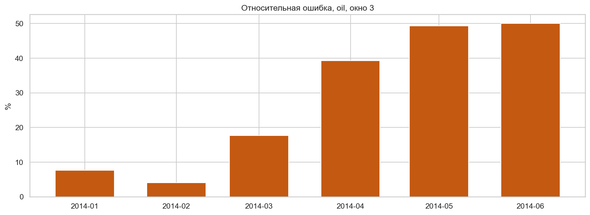

*Подпись.* |факт − прогноз| / |факт| × 100%.

### Окно 3 · газ · 2014 H1

### G22. Газ, окно 3: факт и прогноз

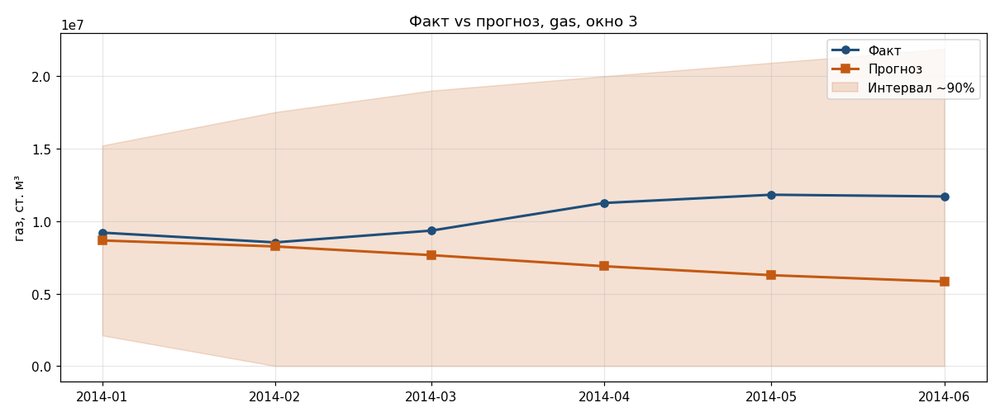

*Подпись.* Факт, прогноз и интервал (~90%) по газу, январь–июнь 2014.

### G23. Газ, окно 3: абсолютная ошибка

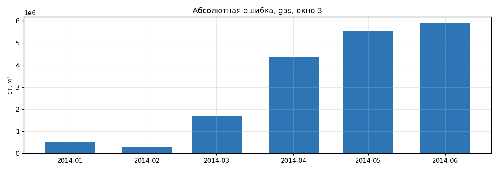

*Подпись.* |факт − прогноз|, ст. м³ / мес.

### G24. Газ, окно 3: относительная ошибка

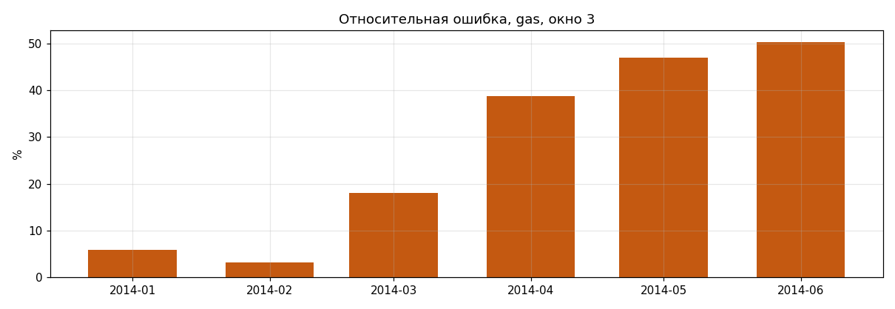

*Подпись.* |факт − прогноз| / |факт| × 100%.

---

### Окно 4 · нефть · 2015 H1

### G25. Нефть, окно 4: факт и прогноз

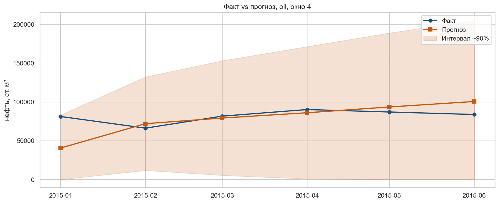

*Подпись.* Факт, прогноз и интервал (~90%) по нефти, январь–июнь 2015.

### G26. Нефть, окно 4: абсолютная ошибка

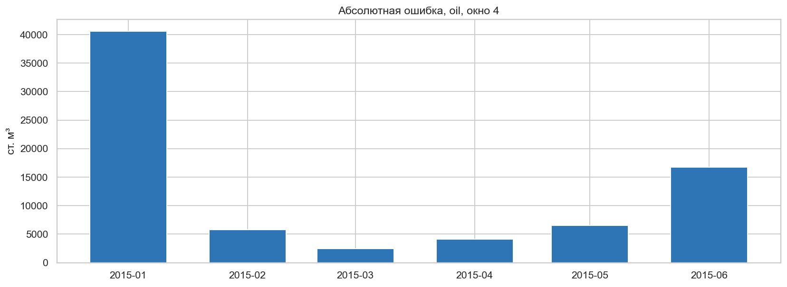

*Подпись.* |факт − прогноз|, ст. м³ / мес.

### G27. Нефть, окно 4: относительная ошибка

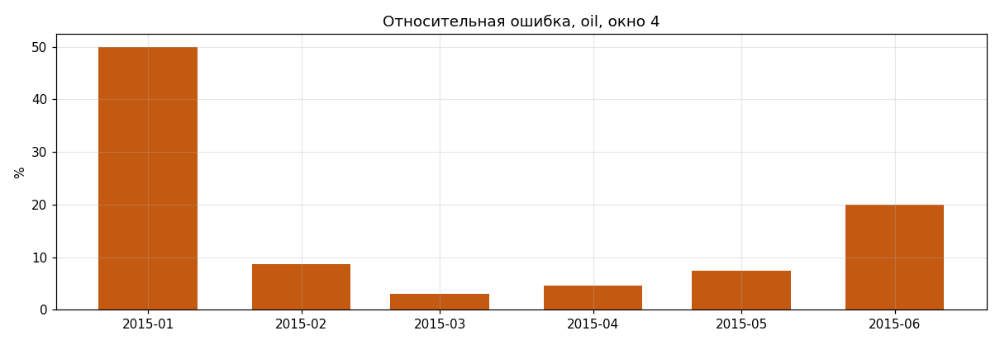

*Подпись.* |факт − прогноз| / |факт| × 100%.

### Окно 4 · газ · 2015 H1

### G28. Газ, окно 4: факт и прогноз

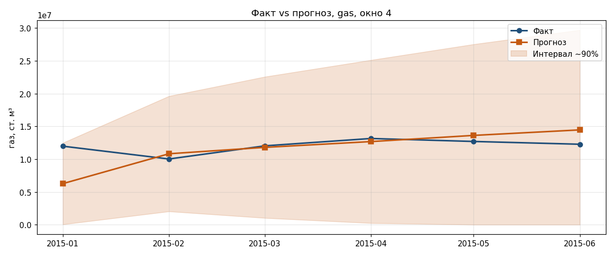

*Подпись.* Факт, прогноз и интервал (~90%) по газу, январь–июнь 2015.

### G29. Газ, окно 4: абсолютная ошибка

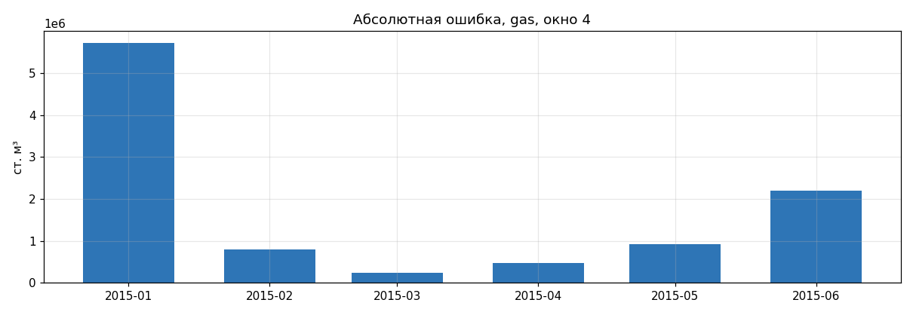

*Подпись.* |факт − прогноз|, ст. м³ / мес.

### G30. Газ, окно 4: относительная ошибка

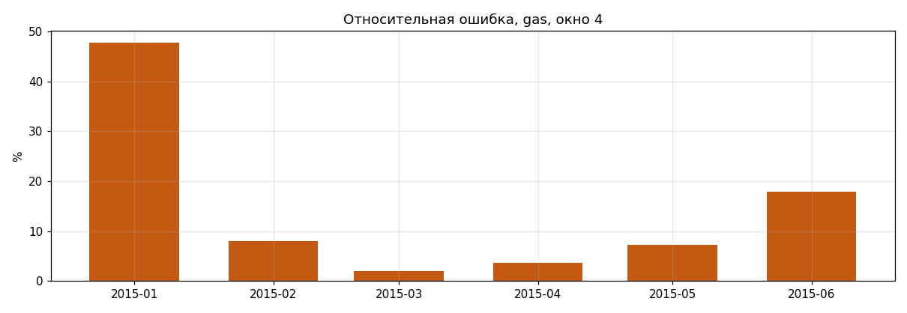

*Подпись.* |факт − прогноз| / |факт| × 100%.

---

### Окно 5 · нефть · 2016 H1

### G31. Нефть, окно 5: факт и прогноз

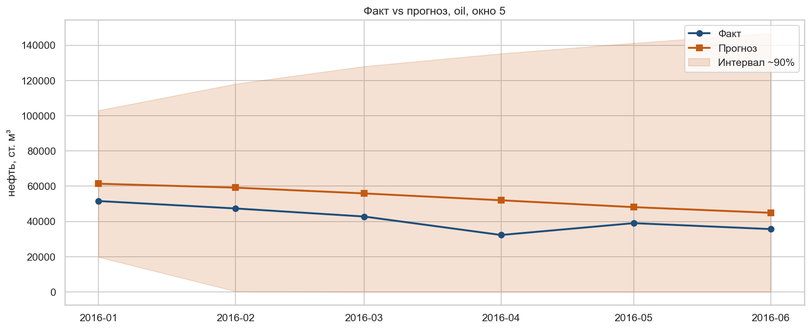

*Подпись.* Факт, прогноз и интервал (~90%) по нефти, январь–июнь 2016.

### G32. Нефть, окно 5: абсолютная ошибка

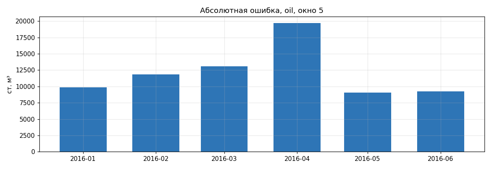

*Подпись.* |факт − прогноз|, ст. м³ / мес.

### G33. Нефть, окно 5: относительная ошибка

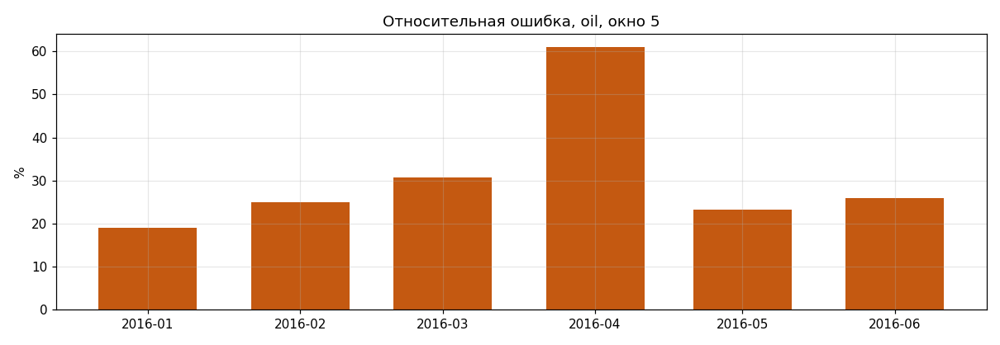

*Подпись.* |факт − прогноз| / |факт| × 100%.

### Окно 5 · газ · 2016 H1

### G34. Газ, окно 5: факт и прогноз

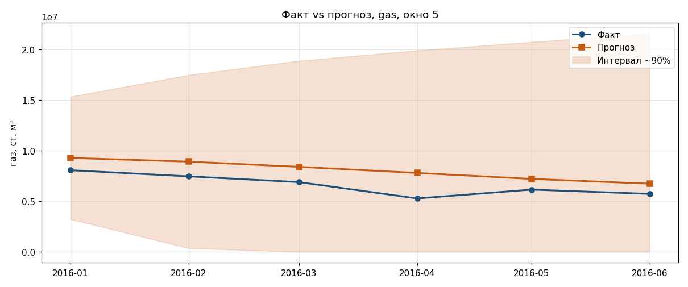

*Подпись.* Факт, прогноз и интервал (~90%) по газу, январь–июнь 2016.

### G35. Газ, окно 5: абсолютная ошибка

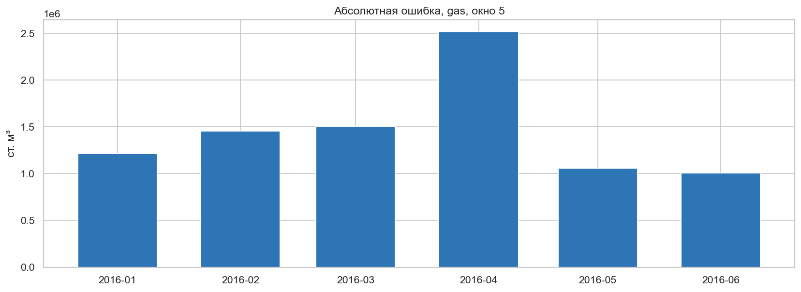

*Подпись.* |факт − прогноз|, ст. м³ / мес.

### G36. Газ, окно 5: относительная ошибка

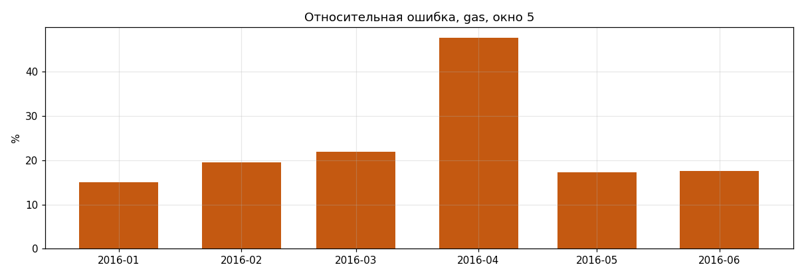

*Подпись.* |факт − прогноз| / |факт| × 100%.

---

## Легенда

Для каждого рисунка: идентификатор, файл, название, зачем он нужен по заданию, что на нём показано.

### G1

- **Название.** Месячный профиль нефти по месторождению с контрольным окном варианта 2.
- **Файл.** `figures/profile_oil_window2.png`
- **Обоснование.** Прямое требование кейса: показать профиль нефти из датасета и выделить указанное контрольное окно (вариант 2).
- **Описание.** Синяя линия — фактическая месячная добыча нефти по сумме стволов. Голубая зона — период обучения до декабря 2011, оранжевая — шесть прогнозных месяцев 2012 H1. Нужен, чтобы видеть, на каком участке кривой падения проверяется модель.

### G2

- **Название.** Месячный профиль газа по месторождению с контрольным окном варианта 4.
- **Файл.** `figures/profile_gas_window4.png`
- **Обоснование.** Прямое требование кейса: то же для газа, вариант 4.
- **Описание.** Фактическая месячная добыча газа. Обучение до декабря 2014, прогноз — 2015 H1. На хвосте обучения виден провал декабря 2014 (простой), из‑за него январский прогноз окна 4 занижается.

### G3

- **Название.** Кривые падения добычи нефти по стволам.
- **Файл.** `figures/wells_oil_decline.png`
- **Обоснование.** Анализ данных и постановка задачи 2: визуализировать кривую падения не только по полю, но и по скважинам. Иначе полевой ряд выглядит как «не Арпс», хотя отдельные стволы падают.
- **Описание.** Каждая линия — один ствол. F-12 и F-14 несут основную добычу с 2008 года; F-11, F-1 C и F-15 D входят позже и ломают гладкое падение суммы.

### G4

- **Название.** STL-декомпозиция месячной добычи нефти.
- **Файл.** `figures/stl_oil.png`
- **Обоснование.** Задача 2: разложить ряд на тренд, сезонность и остаток, чтобы обосновать набор признаков (лаг, календарь, тренд `t`) и отказ от чистой сезонной модели на коротком окне 1.
- **Описание.** Сверху вниз: исходный ряд, тренд (ввод скважин, затем падение к остановке), сезонность периода 12 месяцев, остаток. Сезонность слабее тренда.

### G5

- **Название.** Нефть, окно 2: факт, кривая Арпса и выбранная модель.
- **Файл.** `figures/window2_oil_arps_vs_ml.png`
- **Обоснование.** Задача 2 и кейс: на одном графике факт, baseline Арпса и ML. Окно 2 — то, которое кейс выделяет для нефти.
- **Описание.** Точки факта, треугольники Арпса, квадраты Ridge. На 2012 H1 модель ближе к факту, чем экспонента падения.

### G6

- **Название.** Скважина 15/9-F-12: факт, Арпс и ML, 2015 H1.
- **Файл.** `figures/well_f12_2015.png`
- **Обоснование.** Задача 2 требует скважинный взгляд, а не только сумму месторождения. F-12 — самый длинный добывающий ряд.
- **Описание.** Протокол как у варианта 4 (обучение до 2014-12, прогноз на полгода). Показывает, что тот же конвейер работает на одном стволе.

### G7

- **Название.** Нефть, окно 1: факт и прогноз.
- **Файл.** `figures/w1_oil_fact_pred.png`
- **Обоснование.** Требование кейса: для каждого варианта и каждого флюида — график сравнения месячного профиля из датасета и расчёта модели.
- **Описание.** Январь 2010 почти совпал (~232 vs 230 тыс. ст. м³). Дальше факт падает, blend держит плато: истории мало, режим 2010 H1 меняется.

### G8

- **Название.** Нефть, окно 1: абсолютная ошибка.
- **Файл.** `figures/w1_oil_abs.png`
- **Обоснование.** Требование кейса: график абсолютной ошибки прогноза месячной добычи.
- **Описание.** Столбцы |y − ŷ| в ст. м³. Ошибка растёт к июню, когда факт уходит вниз от плато.

### G9

- **Название.** Нефть, окно 1: относительная ошибка.
- **Файл.** `figures/w1_oil_rel.png`
- **Обоснование.** Требование кейса: график относительной ошибки.
- **Описание.** Проценты к факту месяца. Дополняет G8: при падающем факте та же абсолютная ошибка даёт больший процент.

### G10

- **Название.** Газ, окно 1: факт и прогноз.
- **Файл.** `figures/w1_gas_fact_pred.png`
- **Обоснование.** То же требование сравнения профилей, флюид — газ.
- **Описание.** Картина как у нефти: январь близок, затем факт снижается, прогноз почти плоский.

### G11

- **Название.** Газ, окно 1: абсолютная ошибка.
- **Файл.** `figures/w1_gas_abs.png`
- **Обоснование.** Абсолютная ошибка по газу для варианта 1.
- **Описание.** Масштаб — миллионы ст. м³/мес. Форма столбцов совпадает с нефтью: добыча газа на Volve сильно связана с нефтью.

### G12

- **Название.** Газ, окно 1: относительная ошибка.
- **Файл.** `figures/w1_gas_rel.png`
- **Обоснование.** Относительная ошибка по газу, вариант 1.
- **Описание.** WAPE окна по газу 32.6%. Пик относительной ошибки — в месяцах с более низкой фактической добычей.

### G13

- **Название.** Нефть, окно 2: факт и прогноз.
- **Файл.** `figures/w2_oil_fact_pred.png`
- **Обоснование.** Сравнение профилей для варианта 2, нефть (окно, выделенное кейсом).
- **Описание.** Ridge. Январь завышен, с февраля по июнь ход факта повторяется. Лучшее нефтяное окно: WAPE 16.0%.

### G14

- **Название.** Нефть, окно 2: абсолютная ошибка.
- **Файл.** `figures/w2_oil_abs.png`
- **Обоснование.** Абсолютная ошибка, вариант 2, нефть.
- **Описание.** Основной вклад в MAE даёт январь (~29 тыс. ст. м³), остальные месяцы заметно меньше.

### G15

- **Название.** Нефть, окно 2: относительная ошибка.
- **Файл.** `figures/w2_oil_rel.png`
- **Обоснование.** Относительная ошибка, вариант 2, нефть.
- **Описание.** Подтверждает, что после января относительная ошибка выходит на умеренный уровень.

### G16

- **Название.** Газ, окно 2: факт и прогноз.
- **Файл.** `figures/w2_gas_fact_pred.png`
- **Обоснование.** Сравнение профилей, вариант 2, газ.
- **Описание.** Лучшее газовое окно: WAPE 12.3%. После января прогноз почти ложится на факт.

### G17

- **Название.** Газ, окно 2: абсолютная ошибка.
- **Файл.** `figures/w2_gas_abs.png`
- **Обоснование.** Абсолютная ошибка, вариант 2, газ.
- **Описание.** Как у нефти: максимум в январе, далее столбцы низкие.

### G18

- **Название.** Газ, окно 2: относительная ошибка.
- **Файл.** `figures/w2_gas_rel.png`
- **Обоснование.** Относительная ошибка, вариант 2, газ.
- **Описание.** MAPE 14.4%, WAPE 12.3% — самые низкие среди пяти окон по газу.

### G19

- **Название.** Нефть, окно 3: факт и прогноз.
- **Файл.** `figures/w3_oil_fact_pred.png`
- **Обоснование.** Сравнение профилей, вариант 3. Здесь виден главный отказ модели.
- **Описание.** Факт растёт из‑за ввода F-1 C и F-15 D в 2014. Модель продолжает снижение: будущих скважин в обучении нет. WAPE 30.7%.

### G20

- **Название.** Нефть, окно 3: абсолютная ошибка.
- **Файл.** `figures/w3_oil_abs.png`
- **Обоснование.** Абсолютная ошибка, вариант 3, нефть.
- **Описание.** Ошибка нарастает к маю–июню, когда новые стволы уже дают объём, а прогноз всё ниже.

### G21

- **Название.** Нефть, окно 3: относительная ошибка.
- **Файл.** `figures/w3_oil_rel.png`
- **Обоснование.** Относительная ошибка, вариант 3, нефть.
- **Описание.** К концу горизонта относительная ошибка максимальна: знаменатель (факт) вырос, числитель тоже.

### G22

- **Название.** Газ, окно 3: факт и прогноз.
- **Файл.** `figures/w3_gas_fact_pred.png`
- **Обоснование.** Сравнение профилей, вариант 3, газ.
- **Описание.** Та же развилка, что у нефти: газ растёт вместе с новыми скважинами, Ridge идёт вниз. WAPE 29.6%.

### G23

- **Название.** Газ, окно 3: абсолютная ошибка.
- **Файл.** `figures/w3_gas_abs.png`
- **Обоснование.** Абсолютная ошибка, вариант 3, газ.
- **Описание.** Столбцы растут к лету 2014, параллельно нефтяным.

### G24

- **Название.** Газ, окно 3: относительная ошибка.
- **Файл.** `figures/w3_gas_rel.png`
- **Обоснование.** Относительная ошибка, вариант 3, газ.
- **Описание.** Показывает долю промаха относительно фактического газа в месяце ввода новых мощностей.

### G25

- **Название.** Нефть, окно 4: факт и прогноз.
- **Файл.** `figures/w4_oil_fact_pred.png`
- **Обоснование.** Сравнение профилей, вариант 4, нефть. Кейс отдельно просит газ этого окна на полевом профиле (G2); здесь — сам прогноз.
- **Описание.** Январь занижен: декабрь 2014 был простоем. С февраля по май ход близок к факту. WAPE 15.5%.

### G26

- **Название.** Нефть, окно 4: абсолютная ошибка.
- **Файл.** `figures/w4_oil_abs.png`
- **Обоснование.** Абсолютная ошибка, вариант 4, нефть.
- **Описание.** Доминирует январь (~40 тыс. ст. м³). Июнь снова растёт: модель чуть разгоняется вверх.

### G27

- **Название.** Нефть, окно 4: относительная ошибка.
- **Файл.** `figures/w4_oil_rel.png`
- **Обоснование.** Относительная ошибка, вариант 4, нефть.
- **Описание.** MAPE 15.6% совпадает с WAPE 15.5%: внутри полугодия факт не проваливается к нулю.

### G28

- **Название.** Газ, окно 4: факт и прогноз.
- **Файл.** `figures/w4_gas_fact_pred.png`
- **Обоснование.** Сравнение профилей для газа варианта 4 — окна, выделенного кейсом для газа.
- **Описание.** Как нефть: провал января после простоя, затем хорошее совпадение. WAPE 14.3%.

### G29

- **Название.** Газ, окно 4: абсолютная ошибка.
- **Файл.** `figures/w4_gas_abs.png`
- **Обоснование.** Абсолютная ошибка, вариант 4, газ.
- **Описание.** Январский столбец — следствие низких часов работы в декабре 2014, а не ошибки тренда на всём горизонте.

### G30

- **Название.** Газ, окно 4: относительная ошибка.
- **Файл.** `figures/w4_gas_rel.png`
- **Обоснование.** Относительная ошибка, вариант 4, газ.
- **Описание.** После января относительная ошибка умеренная; итоговый WAPE 14.3% — второе лучшее газовое окно.

### G31

- **Название.** Нефть, окно 5: факт и прогноз.
- **Файл.** `figures/w5_oil_fact_pred.png`
- **Обоснование.** Сравнение профилей, вариант 5: проверка на падающем режиме перед остановкой месторождения.
- **Описание.** Направление падения верное, уровень чуть выше факта. WAPE 29.3% — лучше Арпса (~68%).

### G32

- **Название.** Нефть, окно 5: абсолютная ошибка.
- **Файл.** `figures/w5_oil_abs.png`
- **Обоснование.** Абсолютная ошибка, вариант 5, нефть.
- **Описание.** Столбцы относительно ровные: систематическое завышение, без одного аварийного месяца.

### G33

- **Название.** Нефть, окно 5: относительная ошибка.
- **Файл.** `figures/w5_oil_rel.png`
- **Обоснование.** Относительная ошибка, вариант 5, нефть.
- **Описание.** К апрелю процент выше: факт уже низкий, абсолютная ошибка того же порядка. MAPE 30.8%.

### G34

- **Название.** Газ, окно 5: факт и прогноз.
- **Файл.** `figures/w5_gas_fact_pred.png`
- **Обоснование.** Сравнение профилей, вариант 5, газ.
- **Описание.** Параллельный нефтяному спад. WAPE 22.1% против ~57% у Арпса.

### G35

- **Название.** Газ, окно 5: абсолютная ошибка.
- **Файл.** `figures/w5_gas_abs.png`
- **Обоснование.** Абсолютная ошибка, вариант 5, газ.
- **Описание.** Устойчивое завышение без резкого пика — модель не успевает за ускорением падения к остановке.

### G36

- **Название.** Газ, окно 5: относительная ошибка.
- **Файл.** `figures/w5_gas_rel.png`
- **Обоснование.** Относительная ошибка, вариант 5, газ.
- **Описание.** Процент растёт к середине 2016 вместе с падением знаменателя. MAPE 23.1%, WAPE 22.1%.

---

## Сводка по требованиям кейса

| Что требует задание | Графики |
|---|---|
| Профиль нефти из датасета, окно 2 | G1 |
| Профиль газа из датасета, окно 4 | G2 |
| Факт vs модель по каждому окну и флюиду | G7, G10, G13, G16, G19, G22, G25, G28, G31, G34 |
| Абсолютная ошибка | G8, G11, G14, G17, G20, G23, G26, G29, G32, G35 |
| Относительная ошибка | G9, G12, G15, G18, G21, G24, G27, G30, G33, G36 |
| Кривая падения, STL, Арпс vs ML, скважина | G3, G4, G5, G6 |
